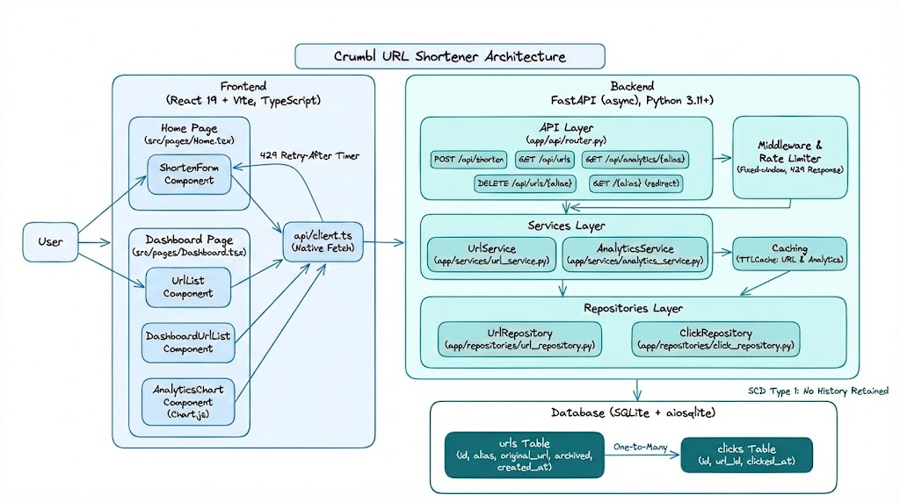
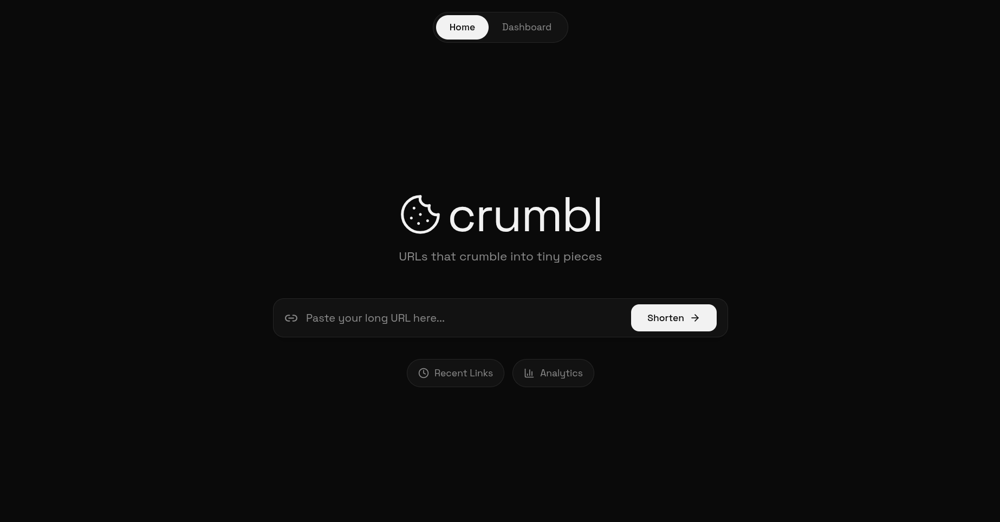
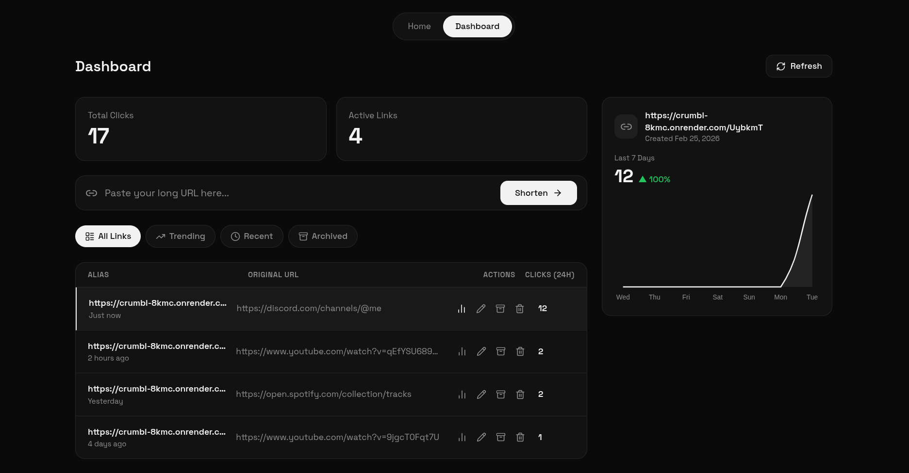

# Crumbl

> URLs that crumble into tiny pieces.

**[Live App](https://crumbl-one.vercel.app/)** · **[API Docs](https://crumbl-8kmc.onrender.com/docs)**

---

## Tech Stack

| Layer | Library / Tool | Purpose |
| ----- | -------------- | ------- |
| **Backend** | Python 3.12 + FastAPI | HTTP API & business logic |
| | Uvicorn | ASGI server |
| | SQLAlchemy + aiosqlite | Async ORM with SQLite |
| | Pydantic | Request / response validation |
| | cachetools | In-memory analytics cache |
| **Frontend** | React 19 + Vite + TypeScript | UI & build tooling |
| | Chart.js | 7-day analytics charts |
| | Tailwind CSS | Styling |
| | pnpm | Package manager |

---

## Live Deployments

| Service | URL |
| ------- | --- |
| **Frontend** | [https://crumbl-one.vercel.app](https://crumbl-one.vercel.app/) |
| **Backend API** | [https://crumbl-8kmc.onrender.com](https://crumbl-8kmc.onrender.com) |
| **Swagger UI** | [https://crumbl-8kmc.onrender.com/docs](https://crumbl-8kmc.onrender.com/docs) |
| **ReDoc** | [https://crumbl-8kmc.onrender.com/redoc](https://crumbl-8kmc.onrender.com/redoc) |
| **OpenAPI JSON** | [https://crumbl-8kmc.onrender.com/openapi.json](https://crumbl-8kmc.onrender.com/openapi.json) |

---

## Local Development

```bash
# 1. Clone
git clone <repo-url> && cd crumbl

# 2. Backend
cd backend
python -m venv .venv
source .venv/bin/activate        # Windows: .venv\Scripts\activate
pip install -r requirements.txt
cp .env.example .env             # optional: configure DATABASE_URL etc.
uvicorn app.main:app --reload --port 8000

# 3. Frontend  (new terminal)
cd frontend
pnpm install
cp .env.example .env             # set VITE_API_BASE_URL=http://localhost:8000
pnpm dev
```

---

## Docker

```bash
cd backend
docker build -t crumbl-backend .
docker compose up --build        # SQLite data persisted in a volume
```

---

## Architecture

<div align="center">
  
</div>

```
crumbl/
├── backend/
│   ├── app/
│   │   ├── api/          # Routes, endpoints, dependencies
│   │   ├── core/         # Config, database, rate limit
│   │   ├── models/       # SQLAlchemy models
│   │   ├── repositories/ # Data access layer
│   │   ├── schemas/      # Pydantic request/response schemas
│   │   └── services/     # Business logic
│   └── tests/
├── frontend/
│   └── src/
│       ├── api/          # API client
│       ├── components/   # UI components
│       ├── hooks/        # useCountdown etc.
│       ├── pages/        # Home, Dashboard
│       └── types/        # API types
└── docs/
```

---

## Snapshots

<div align="center">
  
</div>
<div align="center">
  
</div>
<div align="center">
  
</div>